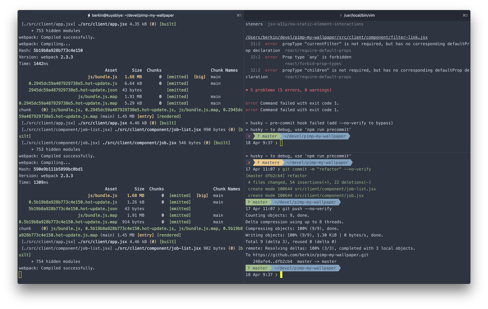
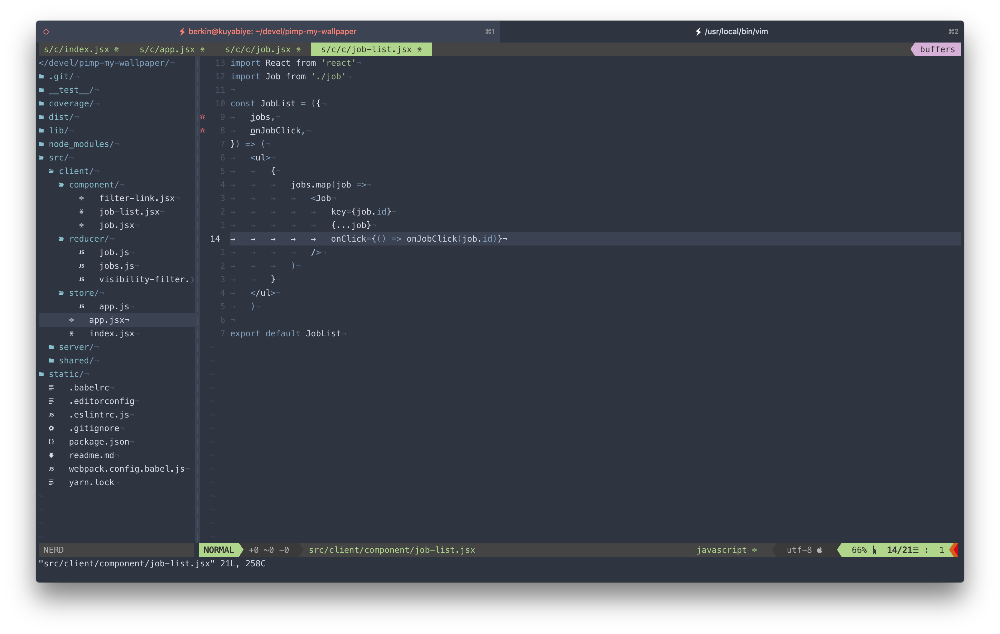

# current look

# dotfiles

- symlink all the files and folder from this repo.
- using 13 pt Meslo LG L Nerd Font _italic_

# todo

- [ ] hyper tab enhance can't find vim icon
- [ ] add screenshot of terminal and vim 
- [ ] is is possible to use terminal with transparent and vim not.
- [ ] add custom ctrlp ignore file for project
- [ ] is it possible to change cursor color according to mode in vim
- [ ] change the ctrlp linepre > to space
